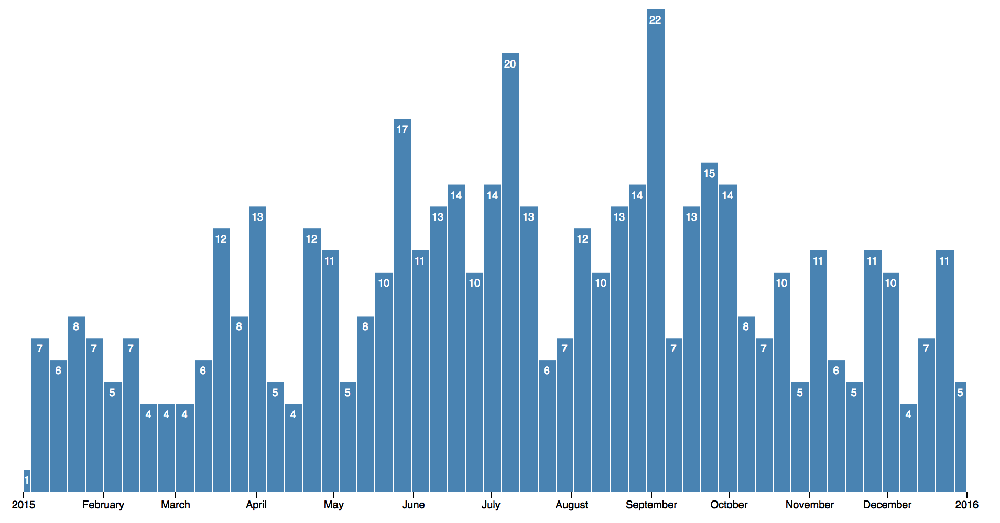
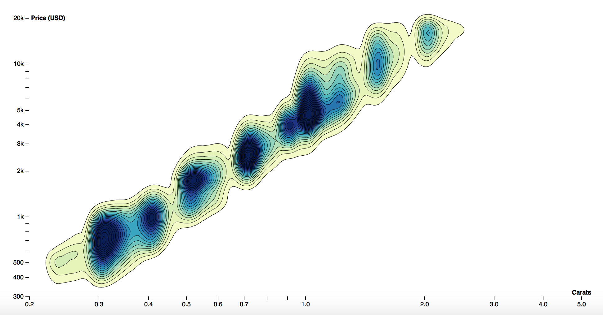

<table>
<tr>
    <td>
        
    </td>
    <td>
        
    </td>
</tr>
</table>

# D3 WITH REACT

---

First install dependencies by executing the `npm install` command

* To run the backend execute `npm run backend` command
  - REST is accessible at http://localhost:4000/diamonds and http://localhost:4000/homicides
* To run the app, execute `npm start` command
  - App is accessible at http://localhost:3000/

### Histogram

Original example can be found at https://bl.ocks.org/mbostock/b2fee5dae98555cf78c9e4c5074b87c3

---

### Countours 

Original example can be found at https://bl.ocks.org/mbostock/7f5f22524bd1d824dd53c535eda0187f

